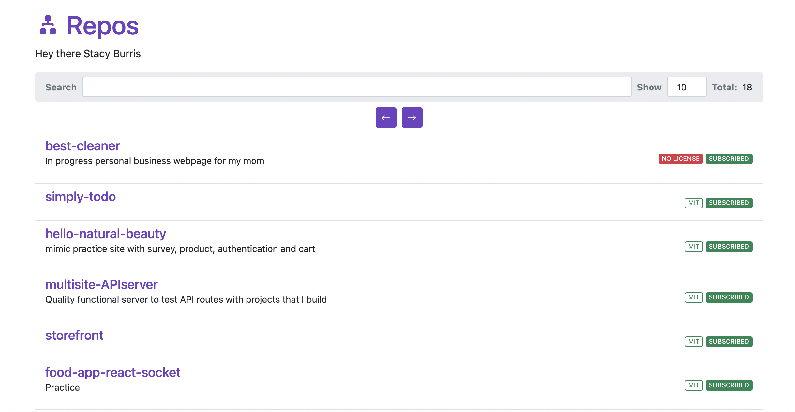

# React GraphQL

**Learning GraphQL with React**

## Author: Stacy Burris



## What I Know About GraphQL:

- Created by Facebook
- Query Language
- Open Source
- A more efficient alternative to REST
- Single API endpoint
- Single request to server (POST) include query in body
  - i.e. HTTP POST

```
  query {
      User(id: "erf4frfr432<THIS IS A MADE UP USER ID>348fhrbf"){
          name
          posts {
              title
          }
          followers(last:3){
              name
          }
      }
  }
```

- Pick up in a JSON object and returned to the client with only what they requested in the body

- REST: structure endpoint according to the clients data

- GraphQL:

  - Changes on client side
  - No need to adjust API when product requirements and designs change
  - Faster feedback cycles and product iteration
  - GraphQL uses strong type systems to define capabilities of an API
  - Schema serves as contract between client and server

Frontend and backend teams can work completely independent from each other!!!

Written in Schema Definition Language or (SDL)

- Defining simple types

The exclamation point (!) below means REQUIRED

```
type Person {       type Post {
    name: String!       title: String!
    age: Int!           author: Person!
    posts: [Post!]!
 }                      }
```

To define 1 to many relationships you can add the author: and posts: refer above and see how they are connected!

Fetching Data with Queries:

    ```
    {
       allPersons {  // field
         name  // payload
      }
    }
    ```

Writing Data with Mutations

3 kinds of mutations: - Creating new data - Updating existing data - Deleting existing data

Subscriptions when a client subscribes to an event it will hold a steady connection to the server

Steam of data sent to the client rather then with REST request response cycle

GraphQL Schema

- Defines capabilities of the API by specifying how a client can fetch and update data
- Represents contract between client and server
- Collection of GraphQL types with special root types

## What I Learned & Notes:

- Explorer GitHub GraphQL API

**GraphQL Requests**

- Queries
- Mutations
- SPDX ID = standard licenses i.e. MIT License
  - license(key: "MIT")
- edges = paginations

**To Generate a Personal Access Token ON GitHub**

- Settings --> Developer Settings --> Generate New Personal Access Token

  - Note: What is the token for? GraphQL Course
  - Check:
    - Repo (all), admin:org (read:org), admin:repo_hook (read:repo_hook), user (all), admin:gpg_key (read:gpg_key)

* **Create and you can only see the access token one time!**

**Notes:**

- useCallback is memoization

### Resource Links

- [Github GraphQL Explorer](https://docs.github.com/en/graphql/overview/explorer)
- [Bootstrap Docs](https://getbootstrap.com/)
- [Bootstrap Icons Docs](https://icons.getbootstrap.com/)

### Instructor: Ray Villalobos

- Senior Staff Instructor at LinkedIn Learning
